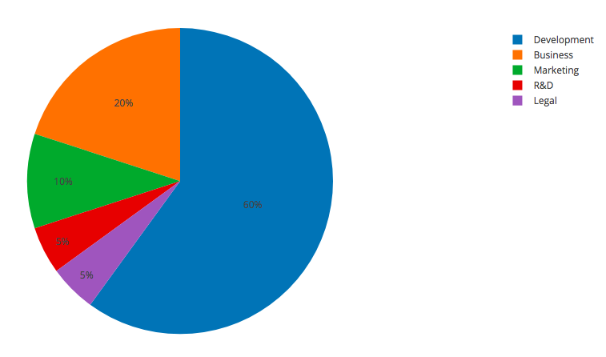

# AVATAR
> A Revolution in Privacy

**Current Status:** DRAFT

Likely to have substantial changes before being finalised.

# Table of Contents
1. [Disclaimer](#disclaimer)
2. [Introduction to AVATAR](#introduction)
3. [What is AVATAR?](#what-is-avatar)
4. [What is the CARBON Token?](#what-is-carbon-token)
    - CARBON Token in AVATAR
5. [The AVATAR Token](#what-is-avatar-token)
    - Token Sale & Distribution
    - Use of the Sale Proceeds
    - Return on Investment
6. [Carbon Labs](#carbon-labs)
7. [Where Are We Now?](#where-are-we-now)
8. [The AVATAR solution](#avatar-solution)
    1. Secure Login
    2. Data Protection
    3. Personalised Anonymity
    4. Data Monetisation
9. [Adoption and Collaboration](#adoption)
11. [Roadmap](#roadmap)

## Disclaimer 
While this document does not preclude [Carbon Labs](#carbon-labs) from offering holders of AVATAR tokens a share of the revenue generated from the commercial applications of the AVATAR ecosystem, such offer, if any, and the extent thereof will be at the sole and absolute discretion of Carbon Labs.  

## Introduction to AVATAR 
AVATAR puts you back in control of your online identity! You should be able to access the internet freely without having to give up your personal information.

In this day and age, it seems everyone knows more about us than we know ourselves. Companies are collecting data about us as much as they can and matching it to our known identities (email addresses, phone numbers, social media accounts etc etc).

We should not be complacent about giving out this information as easily as we do now. The data is sold to thousands of companies from around the world. Companies that we know nothing about, know far too much about ourselves.

We need more control over what data we give up and who we give it up to. There are of course many reasons that giving up this data is valid but sometimes not in the way you may think. For example, a company asking for your date of birth to prove you are older than 18 before viewing a page could just as easily ask the question are you older than 18. You could confirm this without giving up personal details such as your birthdate (which is used in many fraud and identity thefts).

_**AVATAR provides a better way.**_

## What is AVATAR? 
> AVATAR is an identity and authentication manager that puts you in control of your data.

AVATAR allows you to share with clients (websites, app, etc) details about your identity that you choose to share.

The AVATAR ecosystem allows clients to request information directly from you.

You can create as many different AVATARS as you need.

Each of us have different identities depending on what situation we are in. We express ourselves in many different ways. For example, your identity that you show to your friends is different to that you show to your boss.

> An Identity is simply a set of attributes related to an entity.

In our case the entity is your AVATAR and the set of attributes your AVATAR has is defined by you by answering some simple questions. The answers to these questions will become the datapoints that clients can request.

As another example, let's look at some of the different identities of a Woman:

  - Mother
  - Daughter
  - Wife
  - Friend
  - Girlfriend
  - Community Member
  - Boss
  - Colleague
  - and so on.

The same thing goes for when you interact with different clients. You want to be able to provide different dataponts for different situations.

AVATAR is your identity that you are in control of.

As well as managing online identity, AVATAR also provides a quick, easy and secure method of logging in to various clients.

No longer do you need to remember the various username and password combinations that you have setup. You also, do not need to worry about security breaches and people accessing these sites without your knowledge.

_Perhaps you wish to simply comment on a blog post. Rather than having to go through the tedious process of "signing up" to uniquely identify yourself on the website, you can login using your AVATAR (the one you choose to use). You will have instant access along with a unique and secure identity on that system where no one can impersonate you. Whenever you revisit the site, you simply login again using the same AVATAR. No account, no usernames, no passwords, Nothing to remember or forget, NO HASSLE!_

The same AVATAR can be used for as many different websites that you wish.

**AVATARS are both user and site specific.**
To maintain anonymity as much as possible, your AVATAR always presents the same AVATAR ID to the same client, but an entirely different one to every other client. There is no way for cross-site coupling of AVATAR IDs.

## What is the CARBON token? 
CARBON is a utility token, rather than a security. CARBON will be used as the preferred payment method in exchange of all products, services and tools being developed by [Carbon Labs](#carbon-labs) as well as a growing number of other businesses.

For more information, please visit http://carbontoken.info

#### CARBON Token in AVATAR
CARBON will be the preferred cryptocurrency that powers AVATAR. Companies that wish to utilise AVATAR in their own website and apps will need to utilise CARBON to do so.

## The AVATAR Token 
### Token Sale & Distribution
We will not be raising funds in the traditional ICO model as we believe this model is flawed and does not protect the token owners enough. Rather, we have developed a new fund raising model that we have called UTO (Unlimited Token Offer). For more details on how UTO works please read our whitepaper [here](uto.md).

For AVATAR, the UTO will be run with the following settings:

Field | Value
----------|:---------:
Token Name  | AVATAR
Token Symbol | AVATAR
Decimals | 8
Number of tokens per ZIL | 100
Cooling off period | 152470 blocks
Percentage Held | 20%

For clarification, for every 1 ZIL invested a total of 100 AVATAR tokens will be created, 80 for the investor and 20 for Genesys Labs. The ZIL is locked into the contract and is not accessible by anyone including Genesys Labs other than by selling AVATAR tokens back to the contract. The sold AVATAR tokens are burned and the equivalent ZIL is released to the AVATAR token holder.

We also want to highlight a cooling off period, whereby you can get back all of your ZIL that you have invested should you choose to. The cooling off period is specified in blocks but an aproximation of "time" can be caluclated as well.

### Use of the Sale Proceeds
Genesys Labs will use all funding received through its share of the crowdfunding proceeds to support ongoing development of the AVATAR ecosystem.

Most of the funding will initially be used for developer salaries and bounties for open-source contributions to AVATAR.

### Return on Investment
AVATAR token ownership represents your ownership of the AVATAR ecosystem. At any time you like you will be able to sell back your AVATAR tokens to the exchange and receive the equivalent percentage of CARBON and ZIL that is held in the contract.

The smart contract that issues AVATAR will also be the payment wallet for the AVATAR ecosystem.

## Carbon Labs 
Carbon Labs is the company developing AVATAR. It is also the company that launched the CARBON token.

For more information please visit [http://carbontoken.info](http://carbontoken.info)

## Where Are We Now? 
Currently we are trusting large corporations to keep our data safe and use it in a transparent honest way. We know that this is not the case in reality, we only need to look at recent investigations into the misuse of Facebook Data to see the massive problem here.

We also need to trust a number of smaller websites to make sure they keep our data safe.

Things need to change, we should not have to worry about these things at all. We need to take control and ownership on the security and management of our data.

## The AVATAR Solution 

### Secure Login
> A one click, cryptographically secure login solution that does not require prior registration.

Users are embracing one click social login functionality via Facebook, Google, GitHub etc for its ease of use.

It is easy to understand why&hellip;

Manually authenticating yourself on a website or app is tiresome. Users are usually presented with a form that asks for their username or email address and a password. Or, as an alternative and mentioned above, they may be presented with the option of logging in using one click social login functionality.

So, the user has to answer themselves the following:

1. Do I already have an account for this service?
2. If so, did I use an email and password, or one of the social login providers to sign up?
3. If I used an email and password, what is my password?

The user has to do this for every website or app they use.

This is a very tedious process, and it is estimated that the typical user now interacts with over 100 different services. Remembering unique account details for all of these services (many of which are used infrequently) is infeasible. So instead, users use weak easy to remember passwords that they usually use on more than one service.

From a security standpoint this is a disaster.

Even though it is the most common form of authentication currently in use, it is both impractical and prone to security breaches.

And according to a [survey](http://www.prweb.com/releases/2012/1/prweb9086226.htm) conducted in 2012, users are very resistant to traditional registration processes:

- 86% people are bothered by the need to create new accounts when registering on a website and will change their beahaivour as a result.

  - 54% may leave the site or not return.
  - 26% go to a different site if possible.
  - 6% leave/avoid the site.
  - 14% say they will complete the registration.

- 88% admit to having given incorrect information or left forms incomplete when creating a new account at a website.
- 90% admit they have left a website if they forgot their password or login information, instead of answering security questions or re-setting their password.

Social media login however, does provide the following benefits:

1. No more form filling.
2. No need to remember yet another username / password combination.
3. Quick and easy.

However, it also raises huge privacy concerns. The users information is loaded from external providers. These providers are private companies that make money by data mining and selling that data to other companies without your knowledge.

#### AVATAR Login Walkthrough

AVATAR solves all of this by bringing together several technologies to make authenticating with services quick and easy. No need to remember anything. And no need to be worried about data breaches.

**STEP 1:**

User visits website and is presented with a QR code that they can scan with their phone (using the AVATAR app) to authenticate themselves.

**STEP 2:**

The website service validates the authentication and gives access to the user.

> Yes, that is it. From the user standpoint, logging into the website is as easy as scanning a QR code.

Of course, if this is the first time they have logged into this website, the website might ask for additional information, for example a forum will want to know what name you would like to use, or you may have to confirm that you are over the age of 18.

_This can be done in the traditional manner of form filling, but&hellip;_

The QR code itself can ask for this information automatically, so when you scan the QR code, you can select which information you are happy to give to the website.

### Data Protection
> Your data is yours, you own it and you control it.

None of your data is stored anywhere but on your own devices. In building up your AVATAR profile, you can selectively choose to answer questions that are presented to you. The answers to these questions are stored on your device only.

You are in complete control as to who can see this information. Much like filling out a traditional form on a website, but we make it much easier for you to decide what information you allow to be sent and to who.

This also provides companies with more sanitised data; that is the information that they receive from you is going to be more accurate. You can update your information with ease at anytime.

### Personalised Anonymity
> The connected world your way.

AVATAR gives the ability to use data related to a user in a way that allows for high levels of relevant personalisation in a manner that allows the user anonymity and complete control over their own data.

Using a combination of:

1. Attributes
    - Physical
    - Behaivoural
2. Adjusters _(temporary overrides of your current avatar settings)_
3. Influencers
    - Location
    - Weather
4. Qualifiers _(rules based on any of the above dimensions)_

We can allow websites, apps etc to personalise our experience with them without giving up identifiable data.

#### Example Use Cases

**1. Personalised Preference Site Modifier**

Using a combination of a site visitors attributes, adjusters and influencers; the content presented to the visitor will be dynamically generated to better suit their needs.

From as simple as showing where the nearest physical store is to a completely customised experience unique to every visitor which will guarantee a better customer experience and better engagement.

An ecommerce site could automatically show me (as a male) all the male clothing items for sale instead of a generic sale image.

Even better, they could see that I am in London and that it is raining currently and so show me appropriate rainy weather apparel.

A news channel could customise the stories it shows me, if I am not interested in Football, then it would not show me any football related stories.

**2. Dynamic Synergy Networks**

The ability to create networks of people and assets that align with your own interests, attributes etc. For example, a network can be created around all those people that enjoy a particular band and then further segmented down:

- Are attending the next concert in London.
- That live in SW London and would like to meet up before going to the concert.

**3. More Ideas**

I am sure you are already thinking about the different ways the web could be optimised and personalised to you. Here are just a few more ideas:

- Displaying of information only to those that meet certain conditions.
- Automatic changing of language on a website or app.
- Automatic changing of website to assist those with accessibility needs
- Dating site without the need to create a profile
- Store finder that shows automatically the nearest store (to my current location, my house, my place of work)
- Catalogue adjustment incorporating influencers (weather)
- Advertising Targeting - where you get paid

### Data Monetisation
> Get paid for your data. No more middle men selling your data without your knowledge.

As you are well aware, you are blasted with advertising everywhere on the internet. Most of these ads are provided by a few large players (google, facebook). For them the display of an ad not only makes them money, but also is a data collection point for them. They can and do follow you around the internet allowing advertisers to target you based on what websites you visited (amongst other activities).

>**NOTE:** This should be raising red flags for you already. Your anonymity is being attacked constantly and these companies are in many cases building up false information about you. For example, should you do a google search for cancer treatments, visit several websites related to this and then look into life insurance.. the life insurance companies have access to the fact that you have visited these websites and make assumption that you have been recently diagnosed, the quotes you now receive have been inflated. They do not know, that you were doing research for a friend. They make an incorrect assumption about your health.

Billions of dollars are spent on advertising. Of which you see nothing, even though it is your data that they are using to sell their services.

We are creating a system whereby you can be compensated by providing accurate data about yourself (as little or as much as you wish). You will know exactly how much you will get paid on each website you visit for providing this information.

This is a win-win-win for everyone, the website can customise the experience you have with them uniquely to you, advertisers can provide relevant information to you, and you can earn money directly by giving up the information about yourself that you are willing to give up.

## Adoption and Collaboration 
The key to this technology will be the widespread adoption of the AVATAR ecosystem. We will work with a number of providers, developers and integrators to ensure adoption is as easy as possible.

## Roadmap 
We will be publishing our roadmap shortly and will update here as soon as we do.
